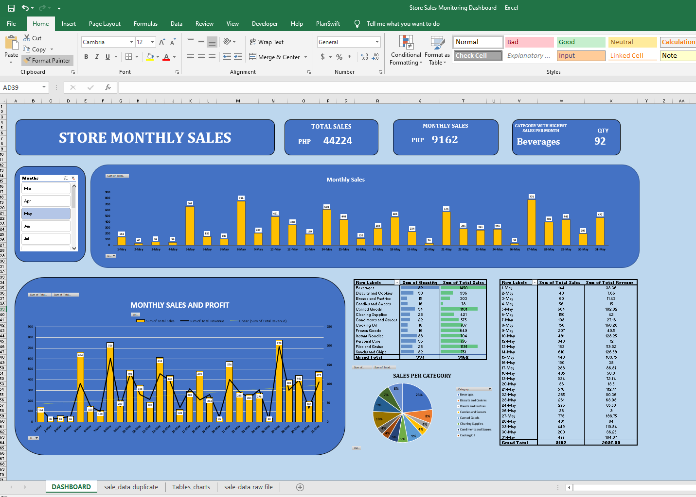

# Store Sales Monitoring Dashboard (Excel)

## Project Overview
This project is an interactive Excel dashboard created to analyze store sales performance, product categories, revenue trends, and quantity sold.

## Tools Used
- Microsoft Excel
- Pivot Tables
- Pivot Charts
- Slicers
- Data Visualization

## Dashboard Features
- Monthly sales tracking
- Revenue monitoring
- Category sales analysis
- Product quantity analysis
- Interactive filtering using slicers

## Skills Demonstrated
- Data analysis
- Dashboard creation
- Data visualization
- Business reporting
- Excel reporting techniques

## Dashboard Preview

